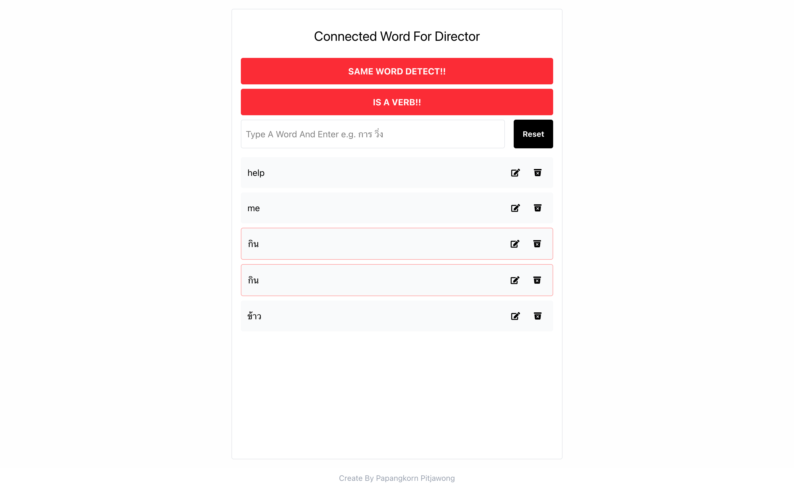

# 📝 Word Duplicate Checker (Next.js + TypeScript)

A simple app for detecting duplicate words typed by the user. It splits words by space and highlights any duplicates with a red border.

## 🚀 Features

- Type and press `Enter` to add words
- Automatically splits multiple words by space
- Checks for duplicates
- Highlights duplicate words with red border
- Remove individual words
- Clear all words with a reset button

## 🛠️ Tech Stack

- [Next.js](https://nextjs.org/)
- [React](https://reactjs.org/)
- [TypeScript](https://www.typescriptlang.org/)
- [Tailwind CSS](https://tailwindcss.com/)

## 📦 Installation

```bash
git clone https://github.com/TAHPAPANGKORN/word-checker-ui.git
cd word-checker-ui
npm install
npm run dev
```

##  How It Works
1. Type words in the input field.

2. Words will appear below, separated if there are spaces.

3. Duplicate words are automatically detected.

4. Duplicates are highlighted with a red border.

5. Each word has a delete button.

6. A reset button clears the entire list.

## 📸 Screenshot



## 👨‍💻 Developer
- Developed by Papangkorn Pitjawong 🙋‍♂️


